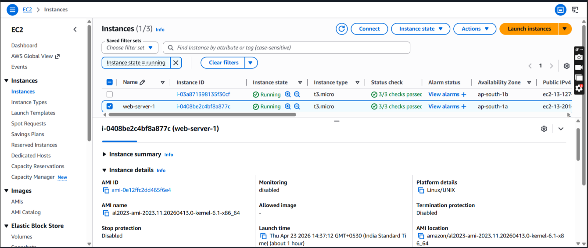

# 🚀 Scalable Web App with NLB and Auto Scaling

## 📌 Overview
This project demonstrates a scalable and high-performance web application architecture on AWS using Network Load Balancer (NLB) and Auto Scaling Group (ASG). The setup is designed to handle high traffic with low latency while automatically scaling EC2 instances based on demand.

---

## 🎯 Objective
To build a highly available and low-latency cloud infrastructure capable of handling large amounts of traffic efficiently using AWS Network Load Balancer and Auto Scaling.

---

## 🧰 AWS Services Used
- Amazon EC2
- Network Load Balancer (NLB)
- Auto Scaling Group (ASG)
- Launch Template
- Security Groups
- Amazon VPC

---

# ⚙️ Architecture Workflow

```text
User Request
      │
      ▼
Network Load Balancer
      │
 ┌───────────────┐
 ▼               ▼
EC2 Instance 1   EC2 Instance 2
      │
Auto Scaling Group manages instances automatically
```

---

# 🔄 How It Works

1. User accesses the NLB DNS URL  
2. Network Load Balancer forwards traffic to healthy EC2 instances  
3. Auto Scaling Group monitors traffic and instance health  
4. Additional EC2 instances launch automatically during high traffic  
5. Failed instances are replaced automatically  

---

# 🛠️ Step-by-Step Setup

## 1️⃣ Launch EC2 Instances

Install Apache Web Server:

```bash
sudo yum install httpd -y
sudo systemctl start httpd
sudo systemctl enable httpd
```

Create sample webpage:

```bash
echo "Server 1 is running" > /var/www/html/index.html
```

---

## 2️⃣ Configure Security Groups

### EC2 Security Group
Allow:
- HTTP (Port 80) from Anywhere
- SSH (Port 22) from your IP

---

## 3️⃣ Create Target Group
- Go to EC2 → Target Groups
- Create a target group
- Select Target Type as Instances
- Register EC2 instances

---

## 4️⃣ Create Network Load Balancer
- Create Internet-facing NLB
- Select VPC and Availability Zones
- Attach Target Group

---

## 5️⃣ Create Launch Template
- Select AMI
- Choose Instance Type
- Attach Security Group
- Add User Data Script

---

## 6️⃣ Create Auto Scaling Group
Configure:
- Desired Capacity = 2
- Minimum Capacity = 1
- Maximum Capacity = 3

Attach:
- Launch Template
- Network Load Balancer

---

## 7️⃣ Test the Application
Open the NLB DNS URL in browser:

```text
http://your-nlb-dns-name
```

Traffic will be routed automatically between EC2 instances.

---

# 📸 Screenshots

## 🖥️ EC2 Instances


---

## 🔐 Security Group Creation


---

## 🌐 Output 1


---

## 🌐 Output 2


---

# 📂 Project Structure

```text
scalable-web-app-nlb-autoscaling/
│── screenshots/
│   ├── EC2_Instance.png
│   ├── Security_group_create.png
│   ├── output_1.png
│   └── output_2.png
│
│── README.md
```

---

# 💡 Key Features
- High Performance Architecture
- Low Latency Traffic Handling
- Automatic Instance Scaling
- Fault Tolerance
- High Availability

---

# 🧠 Learning Outcomes
- Understanding Network Load Balancer
- Configuring Auto Scaling Groups
- Managing EC2 Instances
- AWS Networking Concepts
- Deploying Scalable Cloud Applications

---

# 🔮 Future Improvements
- Add CloudWatch Monitoring
- Configure Dynamic Scaling Policies
- Enable HTTPS Support
- Add Route 53 Domain Integration
- Infrastructure as Code using Terraform

---

# 👩‍💻 Author
**Nitisha Mali**

GitHub: [Nitisha-hub](https://github.com/Nitisha-hub)
